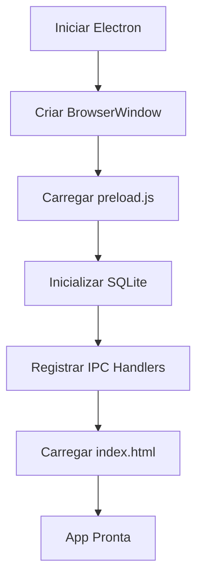
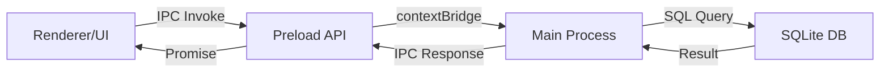

# Plano de Profissionalização - Sistema de Gerenciamento de Arquivos Hospital

## 📋 Visão Geral

Transformar a aplicação web atual em uma aplicação desktop profissional usando Electron, com banco de dados SQLite e estrutura modular organizada.

## 🎯 Objetivos

1. ✅ Criar estrutura de diretórios profissional
2. ✅ Integrar Electron para executável Windows
3. ✅ Implementar banco de dados SQLite persistente
4. ✅ Modularizar código JavaScript
5. ✅ Configurar build para distribuição

## 🏗️ Nova Estrutura de Diretórios

```
arquivo-hospital/
├── src/
│   ├── main/
│   │   ├── main.js              # Processo principal Electron
│   │   ├── preload.js           # Script de preload com IPC
│   │   └── menu.js              # Menu da aplicação
│   ├── renderer/
│   │   ├── index.html           # Interface principal
│   │   ├── css/
│   │   │   └── style.css        # Estilos
│   │   └── js/
│   │       ├── app.js           # Aplicação principal
│   │       ├── database.js      # Camada de acesso ao BD
│   │       ├── auth.js          # Autenticação
│   │       └── ui.js            # Gerenciamento de UI
│   └── db/
│       ├── schema.sql           # Schema do banco
│       └── seeds.sql            # Dados iniciais
├── build/
│   ├── icon.ico                 # Ícone Windows
│   └── icon.png                 # Ícone genérico
├── dist/                        # Executáveis gerados
├── package.json                 # Dependências e scripts
├── electron-builder.json        # Configuração do builder
├── .gitignore
└── README.md                    # Documentação
```

## 📦 Dependências (package.json)

### Dependências de Produção
- `electron`: ~28.0.0 - Framework desktop
- `better-sqlite3`: ~9.2.0 - Driver SQLite nativo e rápido
- `electron-store`: ~8.1.0 - Persistência de configurações

### Dependências de Desenvolvimento
- `electron-builder`: ~24.9.0 - Empacotador
- `electron-rebuild`: ~3.2.0 - Rebuild de módulos nativos
- `cross-env`: ~7.0.3 - Variáveis de ambiente multiplataforma

## 🔧 Componentes Principais

### 1. Main Process (src/main/main.js)

**Responsabilidades:**
- Criar janela principal da aplicação
- Gerenciar ciclo de vida da aplicação
- Configurar segurança (CSP, nodeIntegration)
- Inicializar banco de dados SQLite
- Expor IPC handlers para comunicação

**Fluxo:**


### 2. Preload Script (src/main/preload.js)

**Responsabilidades:**
- Criar ponte segura entre main e renderer
- Expor API contextBridge para o renderer
- Sanitizar inputs/outputs

**API Exposta:**
```javascript
window.electronAPI = {
  // Autenticação
  login: (username, password) => Promise,
  logout: () => Promise,
  
  // CRUD Genérico
  query: (sql, params) => Promise,
  execute: (sql, params) => Promise,
  
  // Operações específicas
  getFuncionarios: () => Promise,
  addGaveta: (data) => Promise,
  getSolicitacoes: () => Promise,
  // ... etc
}
```

### 3. Database Layer (src/renderer/js/database.js)

**Responsabilidades:**
- Abstrair chamadas ao SQLite via IPC
- Implementar métodos CRUD para cada entidade
- Gerenciar transações
- Cache local de dados frequentes

**Entidades:**
```
- usuarios
- funcionarios
- gaveteiros
- gavetas
- pastas
- envelopes
- solicitacoes
- retiradas_com_pessoas
- alertas
- movimentacoes
- logs
```

### 4. UI Layer (src/renderer/js/ui.js)

**Responsabilidades:**
- Renderizar views
- Gerenciar navegação
- Atualizar estatísticas
- Exibir modais e toasts
- Bind de eventos

### 5. Auth Layer (src/renderer/js/auth.js)

**Responsabilidades:**
- Validar credenciais
- Gerenciar sessão do usuário
- Controlar permissões por perfil

## 🗄️ Schema do Banco de Dados SQLite

### Tabelas Principais

```sql
-- Usuários do sistema
CREATE TABLE usuarios (
    id INTEGER PRIMARY KEY AUTOINCREMENT,
    username TEXT UNIQUE NOT NULL,
    senha TEXT NOT NULL,
    perfil TEXT NOT NULL CHECK(perfil IN ('Administrador', 'Usuário Operacional')),
    funcionario_id INTEGER,
    ativo BOOLEAN DEFAULT 1,
    created_at DATETIME DEFAULT CURRENT_TIMESTAMP,
    FOREIGN KEY (funcionario_id) REFERENCES funcionarios(id)
);

-- Funcionários (arquivos físicos)
CREATE TABLE funcionarios (
    id INTEGER PRIMARY KEY AUTOINCREMENT,
    nome TEXT NOT NULL,
    cpf TEXT,
    departamento TEXT NOT NULL,
    data_admissao DATE NOT NULL,
    data_demissao DATE,
    status TEXT NOT NULL CHECK(status IN ('Ativo', 'Demitido')),
    created_at DATETIME DEFAULT CURRENT_TIMESTAMP
);

-- Gaveteiros
CREATE TABLE gaveteiros (
    id INTEGER PRIMARY KEY AUTOINCREMENT,
    nome TEXT NOT NULL,
    localizacao TEXT NOT NULL,
    created_at DATETIME DEFAULT CURRENT_TIMESTAMP
);

-- Gavetas
CREATE TABLE gavetas (
    id INTEGER PRIMARY KEY AUTOINCREMENT,
    gaveteiro_id INTEGER NOT NULL,
    numero TEXT NOT NULL,
    capacidade INTEGER NOT NULL DEFAULT 50,
    ocupacao_atual INTEGER NOT NULL DEFAULT 0,
    created_at DATETIME DEFAULT CURRENT_TIMESTAMP,
    FOREIGN KEY (gaveteiro_id) REFERENCES gaveteiros(id)
);

-- Pastas de funcionários
CREATE TABLE pastas (
    id INTEGER PRIMARY KEY AUTOINCREMENT,
    gaveta_id INTEGER NOT NULL,
    funcionario_id INTEGER NOT NULL,
    nome TEXT NOT NULL,
    data_criacao DATE NOT NULL,
    ativa BOOLEAN DEFAULT 1,
    arquivo_morto BOOLEAN DEFAULT 0,
    created_at DATETIME DEFAULT CURRENT_TIMESTAMP,
    FOREIGN KEY (gaveta_id) REFERENCES gavetas(id),
    FOREIGN KEY (funcionario_id) REFERENCES funcionarios(id)
);

-- Envelopes dentro das pastas
CREATE TABLE envelopes (
    id INTEGER PRIMARY KEY AUTOINCREMENT,
    pasta_id INTEGER NOT NULL,
    tipo TEXT NOT NULL CHECK(tipo IN ('Segurança', 'Medicina', 'Pessoal', 'Treinamento')),
    status TEXT NOT NULL CHECK(status IN ('presente', 'retirado')),
    created_at DATETIME DEFAULT CURRENT_TIMESTAMP,
    FOREIGN KEY (pasta_id) REFERENCES pastas(id)
);

-- Solicitações de retirada
CREATE TABLE solicitacoes (
    id INTEGER PRIMARY KEY AUTOINCREMENT,
    usuario_id INTEGER NOT NULL,
    funcionario_id INTEGER NOT NULL,
    motivo TEXT NOT NULL,
    data_solicitacao DATETIME DEFAULT CURRENT_TIMESTAMP,
    status TEXT NOT NULL CHECK(status IN ('pendente', 'aprovada', 'rejeitada')),
    data_aprovacao DATETIME,
    motivo_rejeicao TEXT,
    FOREIGN KEY (usuario_id) REFERENCES usuarios(id),
    FOREIGN KEY (funcionario_id) REFERENCES funcionarios(id)
);

-- Retiradas ativas com pessoas
CREATE TABLE retiradas_com_pessoas (
    id INTEGER PRIMARY KEY AUTOINCREMENT,
    pasta_id INTEGER NOT NULL,
    usuario_id INTEGER NOT NULL,
    funcionario_id INTEGER NOT NULL,
    data_retirada DATETIME NOT NULL,
    data_prevista_retorno DATETIME NOT NULL,
    data_retorno DATETIME,
    status TEXT NOT NULL CHECK(status IN ('ativo', 'devolvido', 'vencido')),
    dias_decorridos INTEGER DEFAULT 0,
    created_at DATETIME DEFAULT CURRENT_TIMESTAMP,
    FOREIGN KEY (pasta_id) REFERENCES pastas(id),
    FOREIGN KEY (usuario_id) REFERENCES usuarios(id),
    FOREIGN KEY (funcionario_id) REFERENCES funcionarios(id)
);

-- Alertas de vencimento
CREATE TABLE alertas (
    id INTEGER PRIMARY KEY AUTOINCREMENT,
    retirada_id INTEGER NOT NULL,
    tipo_alerta TEXT NOT NULL,
    severidade TEXT NOT NULL CHECK(severidade IN ('aviso', 'crítico')),
    data_criacao DATETIME DEFAULT CURRENT_TIMESTAMP,
    resolvido BOOLEAN DEFAULT 0,
    FOREIGN KEY (retirada_id) REFERENCES retiradas_com_pessoas(id)
);

-- Movimentações de envelopes
CREATE TABLE movimentacoes (
    id INTEGER PRIMARY KEY AUTOINCREMENT,
    item_id INTEGER NOT NULL,
    tipo_item TEXT NOT NULL CHECK(tipo_item IN ('envelope', 'pasta')),
    acao TEXT NOT NULL CHECK(acao IN ('entrada', 'saida')),
    usuario_id INTEGER NOT NULL,
    data DATETIME DEFAULT CURRENT_TIMESTAMP,
    motivo TEXT NOT NULL,
    FOREIGN KEY (usuario_id) REFERENCES usuarios(id)
);

-- Logs de auditoria
CREATE TABLE logs (
    id INTEGER PRIMARY KEY AUTOINCREMENT,
    acao TEXT NOT NULL,
    usuario_id INTEGER,
    timestamp DATETIME DEFAULT CURRENT_TIMESTAMP,
    FOREIGN KEY (usuario_id) REFERENCES usuarios(id)
);

-- Índices para performance
CREATE INDEX idx_pastas_funcionario ON pastas(funcionario_id);
CREATE INDEX idx_pastas_gaveta ON pastas(gaveta_id);
CREATE INDEX idx_gavetas_gaveteiro ON gavetas(gaveteiro_id);
CREATE INDEX idx_envelopes_pasta ON envelopes(pasta_id);
CREATE INDEX idx_retiradas_usuario ON retiradas_com_pessoas(usuario_id);
CREATE INDEX idx_retiradas_status ON retiradas_com_pessoas(status);
CREATE INDEX idx_movimentacoes_data ON movimentacoes(data);
CREATE INDEX idx_logs_timestamp ON logs(timestamp);
```

## ⚙️ Configuração do Electron Builder

```json
{
  "appId": "com.hospital.arquivo",
  "productName": "Sistema de Arquivos Hospital",
  "directories": {
    "output": "dist",
    "buildResources": "build"
  },
  "files": [
    "src/**/*",
    "package.json"
  ],
  "win": {
    "target": ["nsis"],
    "icon": "build/icon.ico",
    "artifactName": "${productName}-Setup-${version}.${ext}"
  },
  "nsis": {
    "oneClick": false,
    "allowToChangeInstallationDirectory": true,
    "createDesktopShortcut": true,
    "createStartMenuShortcut": true,
    "shortcutName": "Sistema de Arquivos"
  }
}
```

## 🚀 Scripts NPM

```json
{
  "scripts": {
    "start": "electron .",
    "dev": "cross-env NODE_ENV=development electron .",
    "build": "electron-builder --win",
    "build:dir": "electron-builder --win --dir",
    "rebuild": "electron-rebuild -f -w better-sqlite3",
    "postinstall": "npm run rebuild"
  }
}
```

## 🔒 Segurança

### Content Security Policy
```javascript
// Em main.js
session.defaultSession.webRequest.onHeadersReceived((details, callback) => {
  callback({
    responseHeaders: {
      ...details.responseHeaders,
      'Content-Security-Policy': [
        "default-src 'self'; " +
        "script-src 'self' 'unsafe-inline'; " +
        "style-src 'self' 'unsafe-inline'; " +
        "img-src 'self' data:; " +
        "font-src 'self' data:;"
      ]
    }
  });
});
```

### Context Isolation
```javascript
// Em BrowserWindow
webPreferences: {
  nodeIntegration: false,
  contextIsolation: true,
  preload: path.join(__dirname, 'preload.js')
}
```

## 📊 Fluxo de Dados



## 🎨 Melhorias de UX

1. **Loading States**: Adicionar spinners durante operações assíncronas
2. **Confirmações**: Diálogos nativos do Electron para ações críticas
3. **Atalhos**: Implementar atalhos de teclado (Ctrl+N, Ctrl+S, etc)
4. **Modo Offline**: Sistema funciona sem internet
5. **Auto-save**: Salvar automaticamente formulários

## 📝 Dados Iniciais (Seeds)

O arquivo `seeds.sql` irá popular:
- 2 usuários padrão (admin e operador)
- 4 funcionários de exemplo
- 2 gaveteiros com gavetas
- Pastas e envelopes iniciais
- Algumas movimentações de exemplo

## 🧪 Testes Recomendados

1. **Funcional**:
   - Login/Logout
   - CRUD de cada entidade
   - Fluxo completo de solicitação → aprovação → retirada → devolução

2. **Performance**:
   - Queries com muitos registros
   - Renderização de tabelas grandes

3. **Segurança**:
   - SQL Injection (via prepared statements)
   - Validação de permissões

## 🚢 Processo de Build

```bash
# 1. Instalar dependências
npm install

# 2. Rebuild módulos nativos
npm run rebuild

# 3. Testar em dev
npm run dev

# 4. Build para Windows
npm run build

# 5. Executável estará em: dist/Sistema de Arquivos Hospital-Setup-1.0.0.exe
```

## 📦 Distribuição

O instalador gerado incluirá:
- Aplicação Electron empacotada
- Node.js runtime
- SQLite nativo compilado
- Ícones e recursos
- Criação de atalhos no desktop e menu iniciar

**Tamanho estimado**: ~150-200 MB

## 🔄 Migração dos Dados Atuais

Como os dados estão em memória, ao executar pela primeira vez:
1. SQLite cria arquivo `database.db` vazio
2. Executa `schema.sql` para criar tabelas
3. Executa `seeds.sql` para dados iniciais
4. Aplicação está pronta para uso

## 📚 Documentação Final

Criar `README.md` com:
- Requisitos do sistema (Windows 10+)
- Instruções de instalação
- Guia de uso rápido
- Credenciais padrão
- Troubleshooting comum
- Contato para suporte

## ✅ Checklist de Conclusão

- [ ] Estrutura de diretórios criada
- [ ] package.json configurado
- [ ] Electron configurado (main + preload)
- [ ] Schema SQLite implementado
- [ ] Módulos JS organizados
- [ ] IPC channels funcionando
- [ ] Interface conectada ao banco
- [ ] Build testado localmente
- [ ] Executável Windows gerado
- [ ] Documentação completa

## 🎯 Próximos Passos Após Aprovação

1. Criar estrutura de pastas
2. Configurar package.json
3. Implementar main process
4. Criar schema e migrar dados
5. Modularizar código
6. Testar e buildar

---

**Tempo estimado de implementação**: 4-6 horas de desenvolvimento focado
**Resultado**: Aplicação desktop profissional pronta para distribuição